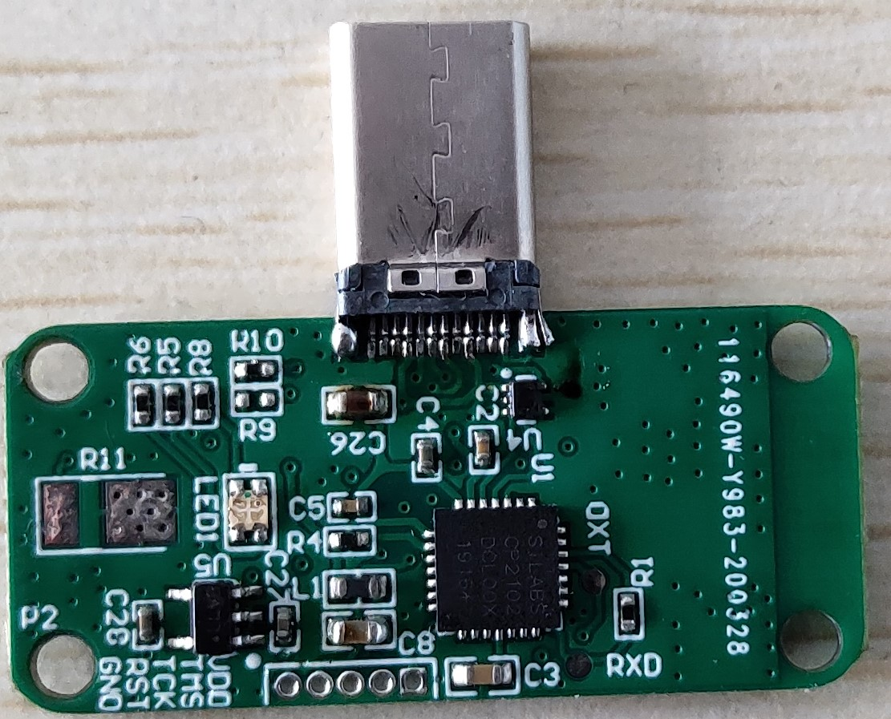
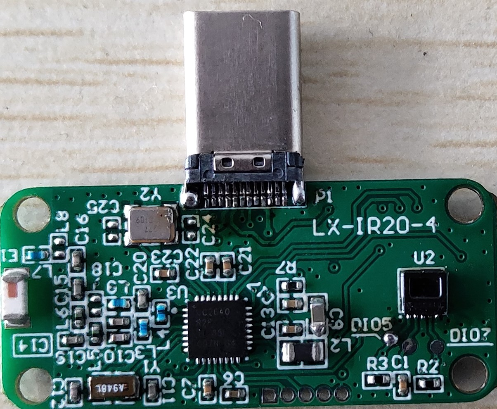
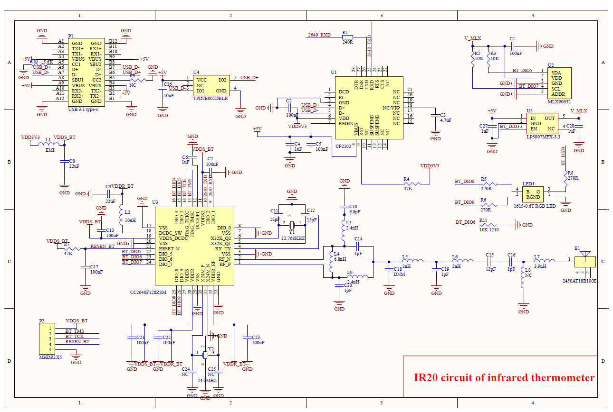

# IR20

Portable Thermometer Device with Type-C interface
===========================================================

In the era of COVID,If you don't want to carry a brick-like Thermometer with you, yet you still want to measure your temperature and those around you(who are willing). You can connect this device to your phone and have your body temperature measured. For those with a 3D printer, You can even design a one-of-a-kind shell.
------------------------------------------------------------

IR20 product (above)
------------------------------------------------------------

IR20 product (above)
------------------------------------------------------------

The IR20 Project is an open source project with infrared temperature sensor. The project includes schematic, PCB Layout ,BOM, embedded software, and communication protocol. Below are the ways that you can use IR 20.
1. Devices that support USB Type-C interfaces including personal computers, Android phones and tablets ect. Communicate with IR20 via USB CDC Protocol. 
2. Devices that support Bluetooth Low Energy 5.0.  Including laptops, iPhones, iPad ect. Communication with IR 20 via Bluetooth.

Main hardware components of IR20
   Main control chip:  
   1. TI CC2640 it have 128 KB  flash   Simplelink  Arm Cortex M3 Bluetooth MCU.
   2. Body temperature sensor:  chip Melexis 90632, Medical grade infrared body temperature sensor. Within the normal temperature range of the human body, It can measure with the accuracy of ±0.2 ℃.
   3. USB conversion chip:  CP2102

----------------------------------------------------------

Schematic

If you need an assembled product you can send an email to the contact@hyperwsn.com with topic of IR20 Hardware Request.The price is $39.99 (freight excluded).